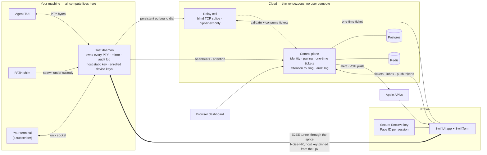
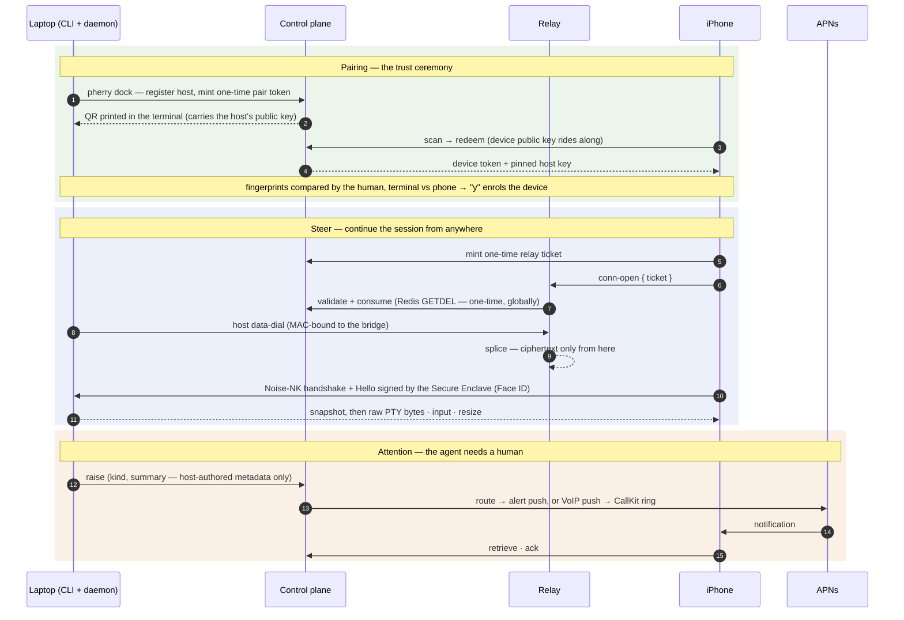

<h1 align="center">Pherry</h1>

<p align="center">
  <strong>Steer your coding agents from your phone.</strong><br/>
  A byte-exact terminal mirror, end-to-end encrypted through a relay that cannot read it.
</p>

<p align="center">
  <a href="https://github.com/omi0/pherry/actions/workflows/ci.yml"></a>
  <a href="./LICENSE"></a>
  
  
</p>

---

Pherry mirrors a coding-agent terminal (Claude Code, Codex, Gemini CLI, OpenCode, Kimi) to an
iPhone — the real terminal, byte for byte — and lets you type into it, approve its actions, and get
**called** when it needs you. You keep working in your own terminal; the phone is a second, equal
viewer of the same session. The cloud in the middle is a thin rendezvous layer that routes metadata
and splices ciphertext. It never sees a byte of a session.

```
$ pherry dock            # sign in once, register this machine, pair the phone with a QR
$ pherry board           # in a repo: install PATH shims for the agents you use
$ claude                 # opens in your terminal as usual — and is now mirrored, E2EE, to your phone
```

## Features

- **Transparent custody.** After `pherry board`, typing an agent's name is intercepted by a PATH
  shim and the agent is spawned by a persistent host daemon that owns its PTY. The TUI still opens in
  your terminal, but your terminal is now just one subscriber. There is no privileged local viewer.
- **One wire, two roles.** Everything is a client of a single versioned, capability-negotiated
  protocol: *hosts* produce sessions, *controllers* steer them. The phone, the CLI, and the web
  dashboard speak the same methods. A new place to run agents is a new host; a new client is a new
  controller.
- **End-to-end encrypted.** A small Noise-NK-style secure channel (X25519, HKDF, XChaCha20-Poly1305)
  with the host's static key pinned from the pairing QR, never from the server. The relay is a blind
  TCP splice that validates one-time tickets and forwards ciphertext. A compromised relay or control
  plane cannot read, forge, or cross-wire a session.
- **Device identity.** The phone's identity is a P-256 key in the Secure Enclave that requires Face
  ID once per foreground session. Enrollment is a fingerprint comparison between the phone screen and
  the terminal, so a malicious control plane cannot enrol a device either.
- **Two implementations of the wire.** The protocol, the secure channel, the relay handshake, and the
  PTY codec exist in TypeScript and in Swift (`PherryKit`). Committed conformance vectors generated
  from the TypeScript build keep the two byte-equivalent.
- **Attention and the ring.** When an agent needs a human, the host raises an attention event. The
  control plane debounces, quotas, and routes it: in-app, an APNs alert, or a VoIP push that rings the
  phone through CallKit. Answering opens the session.
- **Steer-only remote surface.** Arbitrary spawn (caller argv, cwd, env) never leaves the local unix
  socket. The phone can launch an agent remotely, but only from ids the host resolves against its own
  allowlists, and every launch is audited with the device identity.
- **Boot persistence.** The daemon installs as a launchd LaunchAgent on macOS or a systemd user unit
  on Linux, with restart-on-failure and a captured login-shell PATH.

## How it works



Three flows cover the whole product:



The full design is in [`docs/ARCHITECTURE.md`](./docs/ARCHITECTURE.md); the one-page map with
every box and arrow is [`docs/architecture-diagram.md`](./docs/architecture-diagram.md).

## Monorepo

| Path | What | Runs |
|---|---|---|
| [`protocol/`](./protocol) | **The wire.** zod schemas → types, capability negotiation, version rules, the typed RPC method registry, the binary PTY frame codec, a JSON-Schema export. Pure logic, no I/O. | everywhere |
| [`packages/channel/`](./packages/channel) | The E2EE secure channel: Noise-NK-style handshake, HKDF key schedule, XChaCha20-Poly1305 records, strict ordering. Built on `@noble`. | everywhere |
| [`packages/host/`](./packages/host) | The session runtime: host-owned PTY, `Backend` (node-pty + fake), a headless-xterm mirror with snapshot + deltas, the custody desk, `serveConnection`. | laptop |
| [`packages/relay-core/`](./packages/relay-core) | The blind relay rendezvous: outer protocol, DH host proof, the cell, and transport adapters that expose a plain `Duplex` so the channel runs unchanged over a relay. | laptop · cloud |
| [`packages/sdk/`](./packages/sdk) | The `Controller` client. | laptop · phone |
| [`packages/transport-node/`](./packages/transport-node) | Node socket transport, unix listen/connect. | laptop |
| [`packages/cli/`](./packages/cli) | The `pherry` CLI: `dock`, `board`, `anchor`, `unboard`, `attach`, `sessions`, `devices`, `attention`, `service`, plus the reusable terminal-client engine. | laptop |
| `apps/control-plane/` | The router: identity (Clerk behind an injected seam), tenancy, host registration, pairing, one-time relay tickets, attention routing, APNs, audit log. Fastify + Drizzle/Postgres + Redis. | cloud |
| `apps/relay/` | The deployable blind cell: `relay-core` plus the control-plane authorizer. | cloud |
| `apps/dashboard/` | The web console: sign-in, the dock approval page, hosts/sessions/devices, the attention inbox, the audit log. Vite + React. | browser |
| [`ios/`](./ios) | The iPhone controller (SwiftUI, SwiftTerm, PushKit/CallKit, Secure Enclave) and `PherryKit`, the wire in Swift. Outside the pnpm workspace. | phone |

`protocol/` and `packages/*` have no import edge into `apps/`. The engine runs on your machine and
talks the same wire to any control plane, hosted or self-hosted.

## Quick start

**Prerequisites:** Node 20+ (24 recommended), pnpm 11, Docker with Compose v2 for the full stack,
Xcode 26+ and XcodeGen for the phone.

### 1. Local only — an encrypted mirror across two terminals, no cloud

```bash
pnpm install && pnpm -r build
alias pherry="node $PWD/packages/cli/dist/bin/pherry.js"    # or: make link

pherry run bash        # terminal A: spawn a shell under host custody, serve it over an E2EE unix socket
pherry attach          # terminal B: a second viewer of the same session — same bytes, same PTY
```

### 2. The whole stack on your machine

```bash
make up                # Postgres + Redis (Docker) → migrate → seed → control plane :3000, relay :9443, dashboard :5173
pherry dock --api http://127.0.0.1:3000    # sign in (dev token: dev-token-alice), register this host, print the pairing QR
cd ~/code/some-repo && pherry board        # install the PATH shims for this repo
claude                                     # opens normally — and is now a host-owned, mirrorable session
```

`make status`, `make logs`, `make down`. The step-by-step version, including real Clerk sign-in
and the https recipe for a physical iPhone, is [`docs/running-locally.md`](./docs/running-locally.md).

### 3. The phone

```bash
cd ios && xcodegen generate && open Pherry.xcodeproj    # Run on a simulator; paste the pherry://pair link from `dock`
```

Push and the CallKit ring need a physical iPhone, a signed build, and APNs credentials on the control
plane. See [`ios/README.md`](./ios/README.md).

### 4. Production

Two Docker images (control plane, relay), managed Postgres and Redis, a raw-TCP passthrough in front
of the relay. A Fly.io walkthrough and the full environment contract are in
[`docs/deploying.md`](./docs/deploying.md).

## Security model

The relay and the control plane are **untrusted for content**. What that buys, concretely:

- Session content exists only at the two endpoints. The relay splices ciphertext; the control plane
  routes metadata. The host's static key is pinned from the QR, so a malicious server cannot MITM.
- Enrolment is a fingerprint comparison between the phone screen and the terminal, answered on the
  host. A malicious server cannot enrol a device.
- Every signature from the phone requires user presence (Face ID). A stolen unlocked phone cannot
  silently steer a host; connect fails closed on a cancelled prompt.
- The remote surface is steer-only plus constrained launch. Arbitrary argv/cwd/env custody never
  leaves the local unix socket.
- Credentials are hashed at rest and shown once with a display prefix. Relay tickets and pair tokens
  are one-time, consumed atomically. Cross-tenant resources return 404, never 403. Refusals are
  undifferentiated.

The channel has had two internal reviews, a code-level one of the package and an architectural one of
the whole trust graph, and every actionable finding has been implemented. Known residuals are
documented rather than hidden: no rekey within a session, a custom Noise-NK-shaped construction rather
than a full Noise implementation, one host static key across three domain-separated protocols, and an
on-path active attacker who can force a *denial* (never a read) on the host's data dial. It has
**not** been externally audited. Do not put real users on a hosted relay before that happens.
Everything is in [`docs/security/`](./docs/security).

## Development

```bash
make verify                                  # pnpm -r typecheck && pnpm -r test && pnpm -r build && pnpm check
cd ios/PherryKit && swift test               # the wire in Swift, against the committed conformance vectors
```

Tests never need Docker, Clerk, APNs, or a device: Postgres is PGlite, Redis is in-memory, every
external service sits behind an injected seam with a fake, and PTY tests run against a fake backend.
The invariants, the house style, and the verify gate are in [`AGENTS.md`](./AGENTS.md).

## Status

Pherry is pre-release. There is no hosted service: you run the control plane and the relay yourself.

**Implemented**

- The wire, the secure channel, the host runtime, and local multi-viewer custody.
- The blind relay, the control plane, and `pherry dock` onboarding with one-visit browser sign-in.
- The attention plane: raise → debounce · quota · route → in-app, push, ring.
- The web dashboard and the iOS controller.
- Device identity, the enrolment ceremony, mutual authentication in the channel, presence gating,
  and the host and control-plane audit logs.
- Sessions-first phone UX with constrained remote launch across five agent CLIs.
- Boot persistence via launchd and systemd user units.

**Not yet**

- Distribution as a standalone binary through npm, Homebrew, and curl. Today the CLI runs from the
  built workspace.
- The voice worker: a LiveKit room behind the ring, so answering the call is a conversation.
- Cloud sandboxes: agents running in microVMs with the laptop closed.
- An external security audit of the channel.

## Documentation

- [`docs/ARCHITECTURE.md`](./docs/ARCHITECTURE.md) — the design, the invariants, the roadmap.
- [`docs/architecture-diagram.md`](./docs/architecture-diagram.md) — every box, arrow, and trust boundary on one page.
- [`docs/running-locally.md`](./docs/running-locally.md) · [`docs/deploying.md`](./docs/deploying.md)
- [`docs/security/`](./docs/security) — the channel audit, the architectural review, findings and their status.
- Package READMEs: [`protocol`](./protocol/README.md) · [`channel`](./packages/channel/README.md) · [`host`](./packages/host/README.md) · [`relay-core`](./packages/relay-core/README.md) · [`sdk`](./packages/sdk/README.md) · [`cli`](./packages/cli/README.md) · [`ios`](./ios/README.md)

## License

[MIT](./LICENSE).
