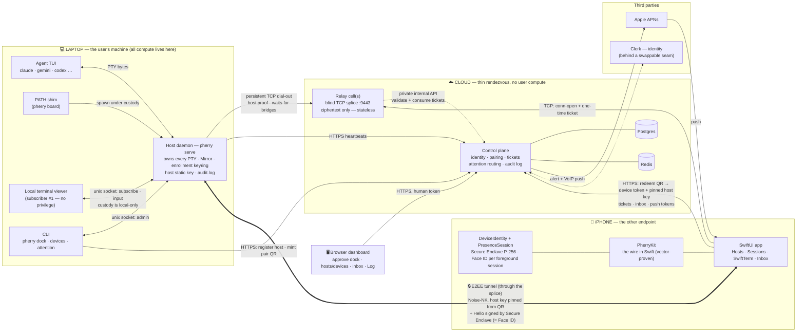
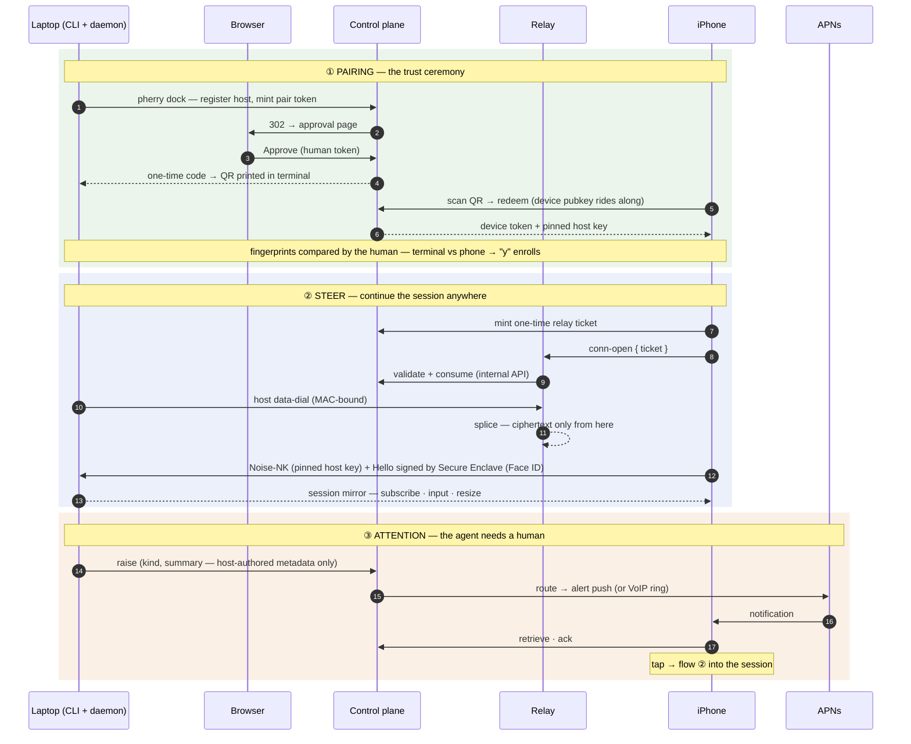

# Pherry — the architecture map

The whole system on one page: what runs where, every arrow, and the trust boundaries.
Companion to [`ARCHITECTURE.md`](./ARCHITECTURE.md) (the full design); this file is the
drawable/diagrammable version. One sentence of orientation: **all user compute stays on user
hardware — the cloud is a thin rendezvous layer that routes metadata and splices ciphertext.**

## The component map

## The boxes — what each component does

### 💻 Laptop (user's machine)

| Component | Role |
|---|---|
| **Agent TUI** | The coding agent itself, launched by typing its name. |
| **PATH shim** (`pherry board`) | Intercepts the launch, hands it to the daemon → the session is born under custody. |
| **Host daemon** (`pherry serve`) | The heart. Owns every PTY (invariant: viewers are equal subscribers). Runs the Mirror, enforces device enrollment (keyring of enrolled phone keys), writes the local audit log, holds the host static key. Remote surface is **steer-only**: list · subscribe · input · resize — custody actions never leave the unix socket. |
| **Local terminal viewer** | The user's own terminal — subscriber #1, no privilege over the phone. |
| **CLI** | Onboarding + admin: `dock` (registration + pairing ceremony), `devices` (enrollment, revoke, audit tail), `attention`. |

### 📱 iPhone

| Component | Role |
|---|---|
| **SwiftUI app** | The controller UI; terminal rendered in SwiftTerm. |
| **PherryKit** | The wire in Swift: E2EE channel (Noise-NK initiator), protocol, device auth — conformance-vector-proven equal to the TS implementation. |
| **DeviceIdentity + PresenceSession** | Secure Enclave P-256 key; every signature demands user presence, supplied once per foreground session (Face ID at the door, silence inside, relock on leaving). |
| **Keychain / PushKit / CallKit** | Device token + pinned host keys; APNs alert and VoIP-ring reception. |

### ☁️ Cloud (the only part you host)

| Component | Role |
|---|---|
| **Control plane** | Router, never the content: identity (Clerk behind `IdentityProvider`), orgs/users, host registration + revocation, pair-QR mint/redeem, **one-time relay tickets**, attention routing (in-app · push · ring), append-only audit log, dashboard API. Internal API on a **private listener**, relay-only. |
| **Relay cell(s)** | The blind rendezvous: both sides dial out to it, it validates tickets + host MACs and splices the two sockets. Stateless, horizontal, sees **ciphertext only**. ~tens of KB RAM per online host (the persistent dial-out is the NAT escape). |
| **Postgres / Redis** | Control-plane state / one-time tickets (atomic GETDEL) + rate limits. |

### Third parties

| Component | Role |
|---|---|
| **Apple APNs** | Delivers alert + VoIP pushes. Free. |
| **Clerk** | Human sign-in, behind a seam — swappable without touching the product. |

### 🖥️ Browser dashboard

Sign-in, the dock **approval page**, hosts/sessions/devices, attention inbox, pair-QR modal,
the audit **Log** tab.

## Trust boundaries (the two dashed lines worth drawing)

1. **Around the E2EE tunnel** — session content exists only at the two endpoints. The relay
   splices ciphertext; the control plane routes metadata. Nothing in the cloud can read a byte
   of a terminal.
2. **Around pairing** — the host key pins from the QR (never from the server), and enrollment
   is a **human-to-human fingerprint comparison** (phone screen vs. terminal, answered `y` on
   the host). The control plane is outside the trust loop even for key exchange: a malicious
   server can neither MITM a session nor enroll a device.

## The three flows

## Where cost lives (for the ops-minded reader)

Per **online** host: one idle TCP socket on a relay cell (~30 KB RAM) + a heartbeat row-update
every couple of minutes. Terminal bytes are a few KB/s while actively mirrored — egress is a
rounding error. The scaling axes, in order: relay-cell RAM (add cells), heartbeat write rate
(batch before ~100k hosts), and the identity provider's per-MAU pricing (the seam exists for a
reason).
